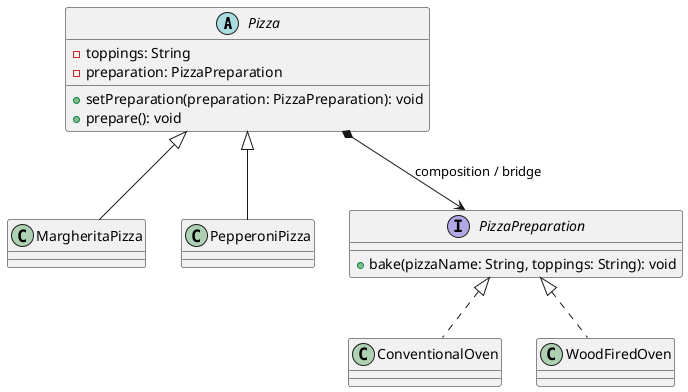

# Assignment 3 — Bridge Pattern

**Course:** ShP-2216 — Software Design Patterns  
**Topic:** Pizza–Preparation Method (Option B: free topic; confirm with the instructor)  
**Language:** Java 17

## What the example demonstrates

The program separates two dimensions that can change independently:

- **Pizza abstraction:** `MargheritaPizza` and `PepperoniPizza` define which pizza is prepared.
- **Preparation implementor:** `ConventionalOven` and `WoodFiredOven` define how it is baked.

The abstract `Pizza` holds a `PizzaPreparation` reference through composition. A pizza can use either baking method when created, and its method can be replaced at runtime. The client can switch methods without changing the pizza class.

## Project structure

```text
src/main/java/edu/aitu/pizza/
├── ConventionalOven.java
├── Main.java
├── MargheritaPizza.java
├── PepperoniPizza.java
├── Pizza.java
├── PizzaPreparation.java
└── WoodFiredOven.java
```

## Run with JDK 17

From the project root in PowerShell:

```powershell
New-Item -ItemType Directory -Force out | Out-Null
$javaFiles = Get-ChildItem src\main\java -Recurse -Filter *.java | ForEach-Object FullName
javac -d out $javaFiles
java -cp out edu.aitu.pizza.Main
```

Expected output:

```text
Preparing pizzas with their initial methods:
Baking Margherita pizza with tomato sauce, mozzarella, and basil in a conventional oven at 220 C.
Baking Pepperoni pizza with tomato sauce, mozzarella, and pepperoni in a wood-fired oven at 400 C.

Changing the Margherita preparation method at runtime:
Baking Margherita pizza with tomato sauce, mozzarella, and basil in a wood-fired oven at 400 C.
```

## UML



## Clean Code principles

1. **Separate responsibilities:** `Pizza` represents what is prepared; `PizzaPreparation` implementations decide how it is baked.
2. **Use role-revealing names:** `Pizza` and `MargheritaPizza` are the abstraction roles; `PizzaPreparation` and `WoodFiredOven` are the implementor roles.
3. **Keep classes focused:** each concrete pizza defines its recipe and delegates baking; each oven defines its baking behavior.
4. **Centralize shared behavior:** the bridge reference and method for delegating to it live in `Pizza`, not in each concrete pizza.
5. **Support extension:** a new oven can implement `PizzaPreparation` without changing the pizza classes.
6. **Validate required dependencies:** `Pizza` rejects a null preparation method instead of failing later during preparation.

See [REPORT.md](REPORT.md) for annotated excerpts and the report draft. Replace its repository URL note with your own GitHub link before submission.

## Bridge versus Adapter

Bridge is designed up front to let the pizza hierarchy and preparation-method hierarchy vary independently. Adapter wraps an existing, incompatible interface so a client can use it through an expected interface. This example defines interchangeable baking methods directly; it does not adapt a legacy oven API.
